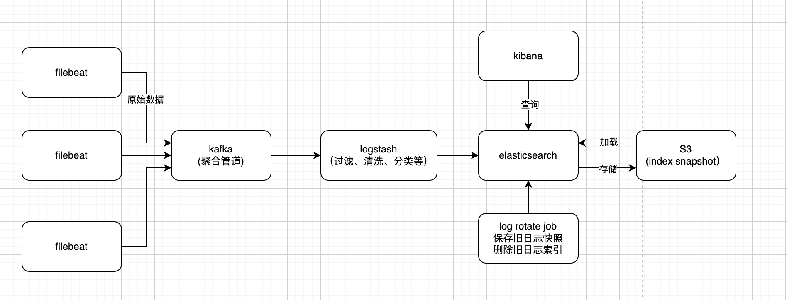

# 加密解密

如何设计一套加密服务？需要一个类似 KMS 的加解密服务以及与之匹配的 SDK。

<figure><figcaption>
加解密流程示意图
</figcaption></figure>

如果要实现对应用程序透明，在启动时自动解密，需要考虑对加密数据单独进行打标。

比如通过`secure.decrypt{{ data }}` 的方式标记 data 需要解密，客户端 SDK 识别后自动执行解密操作，应用层在使用的时候已经是解密后的数据了，没有感知到解密过程。

AppID 和 客户端证书信息如何自动注入呢？肯定不能直接写到配置文件里，可以考虑环境变量注入。
