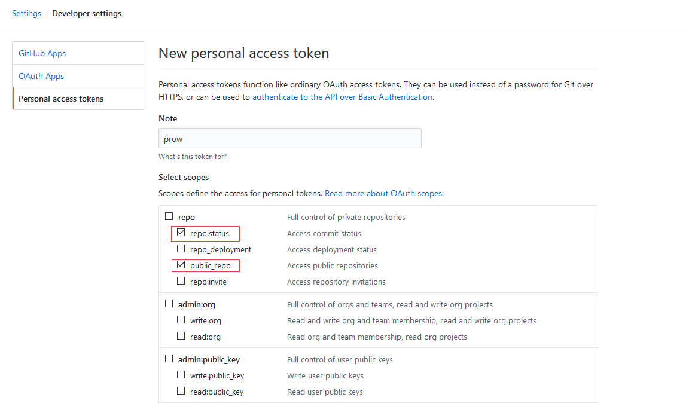
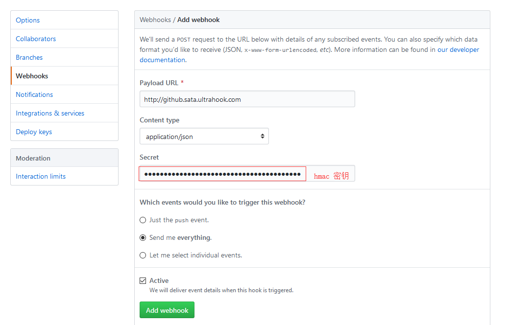
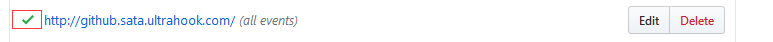
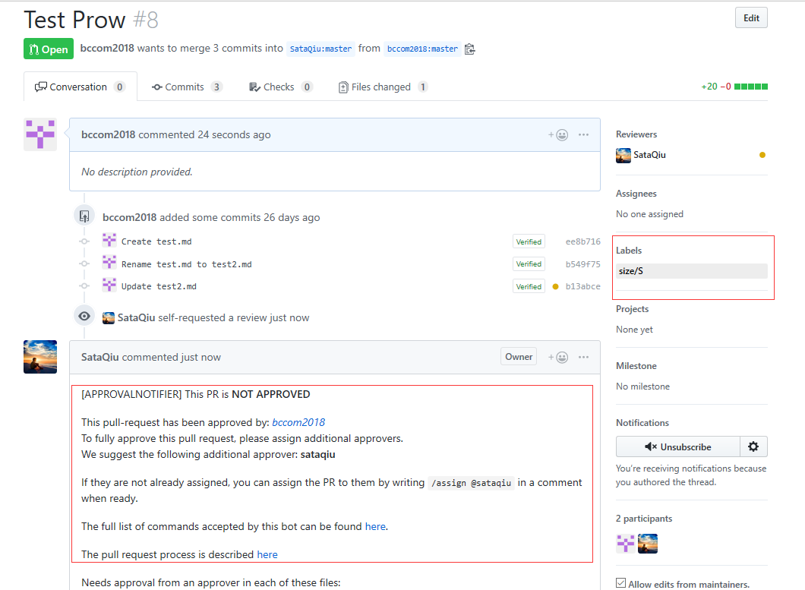

# Prow 部署记录

1. 创建 minikube 集群

    ```sh
    $ minikube start --vm-driver none
    ```

2. 账户密钥设置
   
   - 生成 `hmac-token`，该密钥提供给 GitHub 用于验证 webhook

     ```sh
     $ openssl rand -hex 20 > ./hmac
     $ kubectl create secret generic hmac-token --from-file=hmac=./hmac
     secret/hmac-token created
     ```
   - 生成 `oauth-token`，该密钥具有访问 GitHub 仓库所需要的权限
     
     需要的权限包括：`public_repo`、`repo:status`

     
    
     生成的密钥要记录下来，因为不会再显示第二次！

     ```sh
     $ echo <GitHub OAuth Token> > ./oauth
     $ kubectl create secret generic oauth-token --from-file=oauth=./oauth
     secret/oauth-token created
     ```

     提供给 Prow 使用的 GitHub 账户需要具有对 Org 的 Owner 权限

3. 部署 Prow

    ```sh
    $ kubectl apply -f https://raw.githubusercontent.com/kubernetes/test-infra/master/prow/cluster/starter.yaml
    configmap/plugins created
    configmap/config created
    customresourcedefinition.apiextensions.k8s.io/prowjobs.prow.k8s.io created
    deployment.extensions/hook created
    service/hook created
    deployment.extensions/plank created
    deployment.extensions/sinker created
    deployment.extensions/deck created
    service/deck created
    deployment.extensions/horologium created
    deployment.extensions/tide created
    service/tide created
    ingress.extensions/ing created
    deployment.extensions/statusreconciler created
    namespace/test-pods created
    serviceaccount/deck created
    rolebinding.rbac.authorization.k8s.io/deck created
    rolebinding.rbac.authorization.k8s.io/deck created
    role.rbac.authorization.k8s.io/deck created
    role.rbac.authorization.k8s.io/deck created
    serviceaccount/horologium created
    role.rbac.authorization.k8s.io/horologium created
    rolebinding.rbac.authorization.k8s.io/horologium created
    serviceaccount/plank created
    role.rbac.authorization.k8s.io/plank created
    role.rbac.authorization.k8s.io/plank created
    rolebinding.rbac.authorization.k8s.io/plank created
    rolebinding.rbac.authorization.k8s.io/plank created
    serviceaccount/sinker created
    role.rbac.authorization.k8s.io/sinker created
    role.rbac.authorization.k8s.io/sinker created
    rolebinding.rbac.authorization.k8s.io/sinker created
    rolebinding.rbac.authorization.k8s.io/sinker created
    serviceaccount/hook created
    role.rbac.authorization.k8s.io/hook created
    rolebinding.rbac.authorization.k8s.io/hook created
    serviceaccount/tide created
    role.rbac.authorization.k8s.io/tide created
    rolebinding.rbac.authorization.k8s.io/tide created
    serviceaccount/statusreconciler created
    role.rbac.authorization.k8s.io/statusreconciler created
    rolebinding.rbac.authorization.k8s.io/statusreconciler created
    ```

    ```sh
    $ kubectl get pod
    NAME                                READY   STATUS    RESTARTS   AGE
    deck-594d6f69b9-h6bcp               1/1     Running   0          14m
    deck-594d6f69b9-lzn89               1/1     Running   0          14m
    hook-7cb8658f4b-9wwww               1/1     Running   0          14m
    hook-7cb8658f4b-jnsvl               1/1     Running   0          14m
    horologium-7df87c4d54-zzmbb         1/1     Running   0          14m
    plank-64f4c7bdc5-n4snz              1/1     Running   0          14m
    sinker-5fb68b9fcf-dwwjx             1/1     Running   0          14m
    statusreconciler-5f9cfd4c84-npzwm   1/1     Running   0          14m
    tide-fbfd45564-g868g                1/1     Running   0          14m
    ```

4. 配置 Webhook
   
    首先，查看下 hook 服务绑定的 NodePort

    ```sh
    $ kubectl get svc
    NAME         TYPE        CLUSTER-IP       EXTERNAL-IP   PORT(S)          AGE
    deck         NodePort    10.104.197.115   <none>        80:31349/TCP     20m
    hook         NodePort    10.104.129.203   <none>        8888:31048/TCP   20m
    kubernetes   ClusterIP   10.96.0.1        <none>        443/TCP          59m
    tide         NodePort    10.106.128.183   <none>        80:32601/TCP     20m
    ```

    可以看出，hook 监听在 31048 端口

    使用 ultrahook 开放外网地址

    ```sh
    $ yum install gem ruby-devel gcc
    $ gem install ultrahook
    $ echo "api_key: Your API Key" > ~/.ultrahook
    $ ultrahook github http://127.0.0.1:31048/hook
    Authenticated as sata
    Forwarding activated...
    http://github.sata.ultrahook.com -> http://127.0.0.1:31048/hook

    ```

    正式配置 Webhook

    

    显示对勾即为可用

    

5. 配置 Prow 使用的插件

    创建 `plugins.yaml` 文件

    ```yaml
    plugins:
      SataQiu/trans:
      - approve
      - assign
      - blunderbuss
      - cat
      - dog
      - hold
      - lgtm
      - size
      - wip
      - trigger
    ```

    ```sh
    $ kubectl create configmap plugins   --from-file=plugins.yaml=./plugins.yaml --dry-run -o yaml   | kubectl replace configmap plugins -f -
    ```

6. 测试 PR

    发送一个 PR 到 SataQiu/trans，即可看到效果

    
