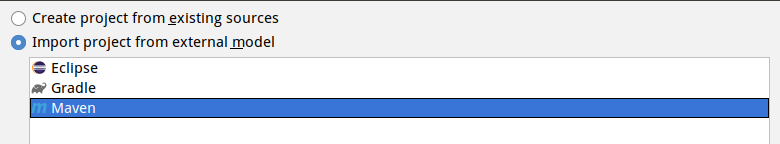
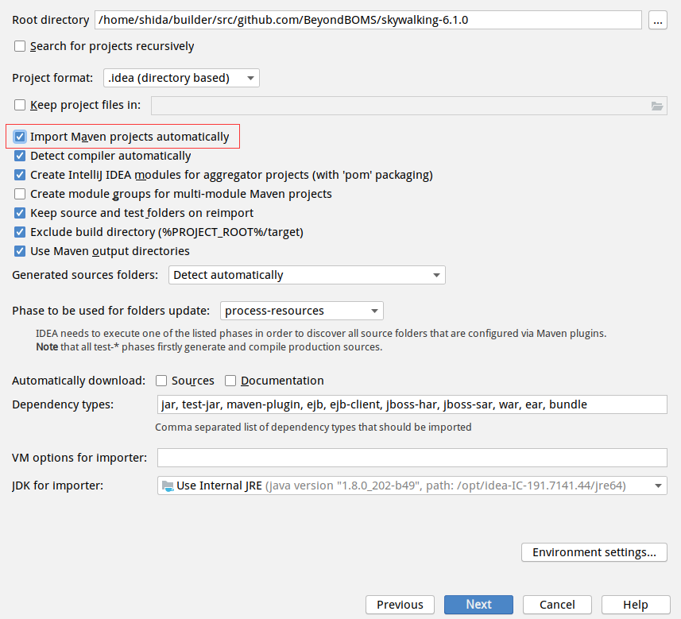
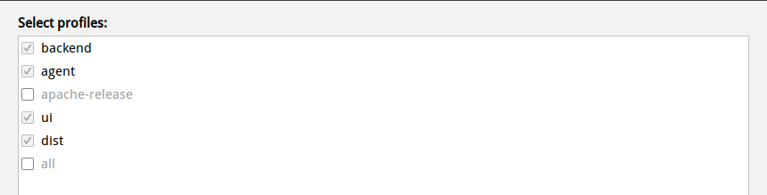
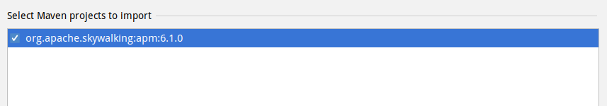
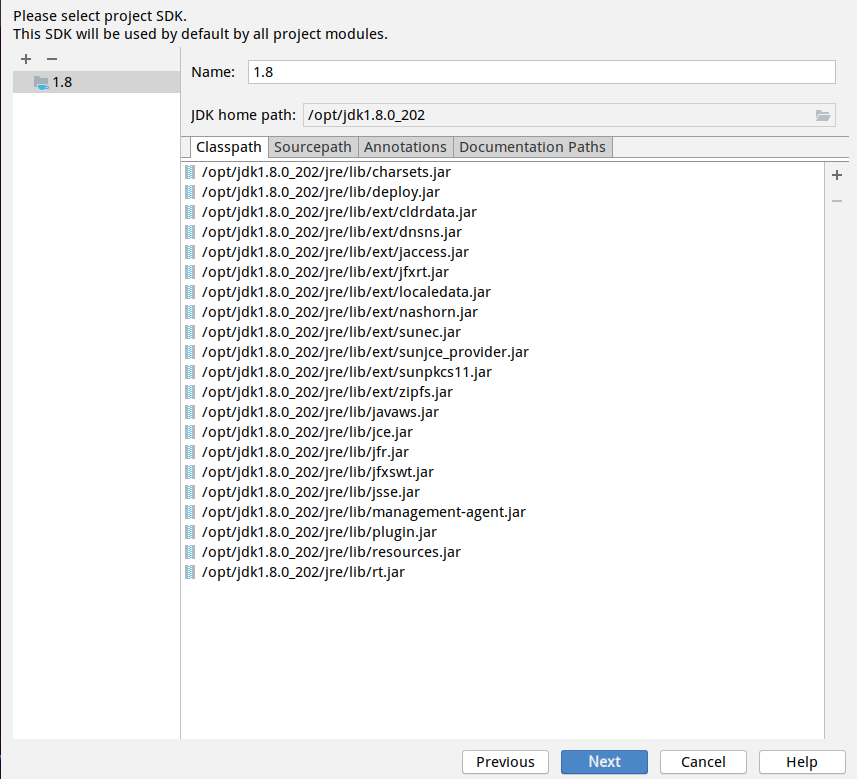
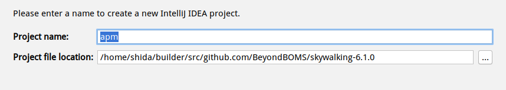
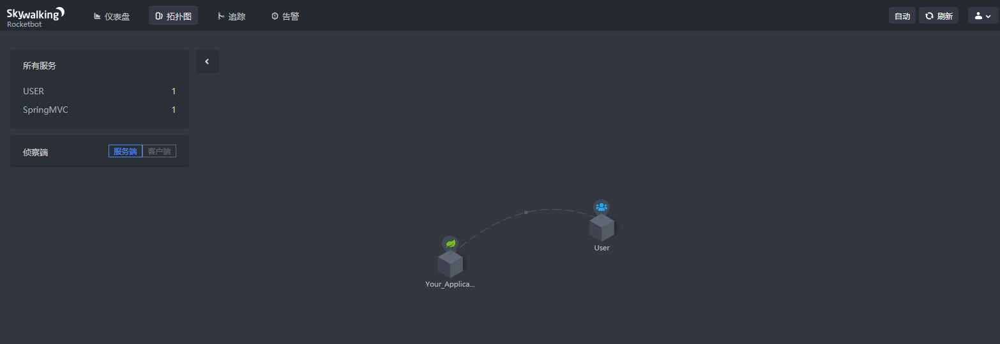

# SkyWalking 开发环境搭建

本文以 6.1.0 版本为例，说明 SkyWalking 开发环境的搭建步骤

官方参考链接：[How-to-build](https://github.com/apache/skywalking/blob/master/docs/en/guides/How-to-build.md)

### 1. 基础环境需求

- Git
- JDk 8
- Maven 3
- IntelliJ IDEA (2019.1.2)

### 2. 下载并导入项目到 IDEA

2.1 克隆项目到本地

```sh
$ git clone https://github.com/apache/skywalking.git
```

2.2 编译项目生成 gPRC 相关源码

```sh
$ ./mvnw clean package -DskipTests
$ ./mvnw compile -Dmaven.test.skip=true
```

2.3 将 SkyWalking Maven 项目导入 IntelliJ IDEA













2.4 配置 ES 存储服务

为了简单，这里以容器方式运行单节点 ES 实例

```sh
docker run -d --name elasticsearch -p 9200:9200 -p 9300:9300 -e "discovery.type=single-node" elasticsearch:6.7.0
```

2.5 启动 OAP Server

以普通 Java 方式运行：
`oap-server/server-starter/src/main/java/org/apache/skywalking/oap/server/starter/OAPServerStartUp.java`

2.6 启动 UI

以普通 Java 方式运行：
`apm-webapp/src/main/java/org/apache/skywalking/apm/webapp/ApplicationStartUp.java`

浏览器访问 `localhost:8080` 即可看到展示页面。

2.7 运行 Agent

这里通过运行 SpringBoot Demo 程序，生成追踪数据

```sh
java -javaagent:/root/demos/SKY/apache-skywalking-apm-bin/agent/skywalking-agent.jar -jar springboot-demo-0.0.1-SNAPSHOT.jar
```


